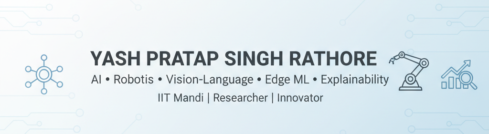

  

<h1 align="center">👋 Hi, I'm Yash Pratap Singh Rathore</h1>
<h3 align="center">AI Developer | Researcher | Robotics & Explainable ML Enthusiast</h3>

---

 🚀 About Me
- 🎓 Student at IIT Mandi
- 🤖 Passionate about AI, Vision-Language Navigation, and Edge Intelligence
- 💡 Focused on building Explainable, Responsible, and Real-Time AI Systems
- 🔍 Research Interests: Vision-Language Models, Autonomous Drones, Explainability, and ML System Deployment

---

 🧠 What I’ve Worked On

- ⚙️ Worked on 6+ distinct technical and research projects across:
  - Vision-Language Navigation (Sim2Real & ROS)
  - Edge ML Deployment (Jetson Nano / Jetson Xavier)
  - Deepfake Detection and Digital Forensics
  - Explainable AI and Responsible ML Apps
  - Autonomous Drone Flight (FlightGPT / LLVM Drone)
  - Mechatronics & Embedded System Design (Home Automation, Adaptive Shading)

- 🧩 Built interactive Streamlit apps showcasing explainability and real-time model predictions  
  using SHAP, LIME, and custom visualization frameworks.

- 📊 Specialized in feature engineering, model optimization, and interpretable tabular modeling  
  with consistent AUC > 0.68 in national machine-learning hackathons.

---

 🏆 Achievements & Hackathons

| Event | Achievement |
|--------|--------------|
| 🥇 Zentej Hackathon 2025 | Winner — Deepfake Detection Project; completed all technical milestones and proposal phase |
| 🧠 AIHack India 2025 (IIT Mandi × AiFul Japan) | Top 10 on leaderboard — Built an Explainable Credit Risk App with live SHAP visualizations |
| ⚡ Machine Learning Competitions | Achieved AUC > 0.68 through advanced feature engineering and model optimization |
| ✈️ FlightGPT / LLVM Drone | Developed and deployed real-time obstacle avoidance on NVIDIA Jetson hardware |
| 💳 Credit Scoring Model Enhancements | Improved credit risk model accuracy from mid-0.67 upward through categorical and numerical feature optimization |
| 💻 Prototyping & Research Demos | Built and showcased multiple interactive ML prototypes and research presentations, motivating new collaborations |

---

 💼 Highlight Project — Credit Risk Analyzer
> 🏆 AIHack India 2025 — IIT Mandi × AiFul Japan

An Explainable, Ethical, and Actionable AI platform for smarter lending.  
Built using Streamlit, LightGBM, and SHAP, this app predicts borrower risk,  
explains key contributing factors, evaluates fairness, and generates dynamic credit reports.

🔗 [View Repository](https://github.com/pratap424/AIFUL-Credit-Risk-Analyzer)

---

 🧰 Tech Stack

 💻 Languages & Frameworks
`Python` · `C++` · `Streamlit` · `PyTorch` · `scikit-learn` · `LightGBM` · `OpenCV` · `ROS` · `KiCAD`

 🧠 Core Skills
Explainable AI (SHAP/LIME) • ML Deployment (Edge/Cloud) • Computer Vision • Feature Engineering • Autonomous Systems

 ⚙️ Tools & Platforms
Jetson Nano/Xavier • Streamlit Cloud • Kaggle • GitHub Actions • Ubuntu/WSL2 • VS Code

---

 🔬 Current Focus
- 🧭 Vision-Language Navigation for real-world assistive drones  
- 🪶 Edge AI Optimization for low-power inference  
- 🔍 Model Transparency and Trust using explainability frameworks  

---

 🌐 Connect With Me

  
  
  

---

 📊 GitHub Stats

  
  

---

 🧩 Featured Projects
- [💳 Credit Risk Analyzer](https://github.com/pratap424/AIFUL-Credit-Risk-Analyzer) — Explainable AI app with SHAP and Streamlit
- [🧠 Deepfake Detection System]() — Winner at Zentej Hackathon, used EfficientNet & MesoNet for forgery classification
- [🚁 FlightGPT Autonomous Drone]() — Real-time obstacle avoidance & edge deployment on Jetson
- [🏡 Smart Window Shading System]() — IoT-mechatronics hybrid system built using KiCAD & microcontrollers

---

 🧩 Complete Project & Research Portfolio

 🧠 1. AI Assist Vision
Type: Research Project (Assistive Technology, Vision-Language Models)  
Goal: Develop a real-time assistive system for visually impaired individuals that understands the environment and provides multimodal feedback.  
Status: Completed — functional prototype tested locally and on GPU laptop.  

Highlights:
- Built a vision-language navigation pipeline combining scene captioning, depth estimation, and spatial audio guidance.  
- Integrated SmolVLM2-500M for video-based scene understanding.  
- Designed urgency-based voice feedback for adaptive guidance.

---

 🚁 2. Flying Eyes — Interactive Vision Through Intelligent Drones
Type: Doctoral Research Proposal (Under Dr. Amit Shukla, IIT Mandi)  
Goal: Enable drones to act as “intelligent extensions of human vision” — understanding scenes and responding to natural commands in real time.  

Core Features:
- Vision-language understanding from drone video feeds  
- Natural command processing (e.g., “Find person on the ground”)  
- Dual interaction: user-initiated commands + drone-generated alerts  
- Real-time inference with ONNX optimization  

Datasets: BDD100K, Ego4D  
Focus Areas: Vision-Language Models, Aerial Robotics, Human-Drone Interaction  
Status: Active Research  

---

 🧠 3. ICRS 2024 — Idea Innovation Competition
Type: Academic Innovation Challenge (IIT Mandi)  
Project: AI Assistant for Visually Impaired  
Event: ICRS 2024 (Idea Innovation Track)  
Achievement: 🏆 Winner — Innovative Idea Category  

Focus:
- Real-time assistive AI for accessibility  
- Lightweight and efficient deep learning for embedded hardware  
- Prototype demonstrated scene narration and obstacle avoidance

---

 🔍 4. Additional Highlights
- LLVM Drone Project: Built real-time obstacle avoidance and navigation for drones using Jetson Nano and edge inference.  
- Home Automation for Adaptive Shading: Mechatronics project using KiCAD and custom PCB design.  
- Explainability Research: Created SHAP-based frameworks for interpretability in finance and healthcare.  
- Deepfake Detection (Zentej Hackathon): Built CNN architectures for forgery classification.

---

 🏅 Highlights
- 🏗️ Built and deployed end-to-end ML pipelines with explainable frontends  
- 🤝 Collaborated on cross-disciplinary research (AI × Robotics × Mechatronics)  
- 🧭 Continuously improving through hackathons, simulations, and real-world testing

---

 💬 Favorite Quote
> "Transparency builds trust — and trust builds technology."

---

⭐ If you like my projects, don’t forget to star them on GitHub!
